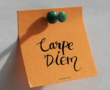

오늘 오징어게임 리뷰영상을 하나 보고, 이런저런 생각이 들어서 끄적거리러 들어왔다. 


우리는 우리가 알게 모르게 타자의 욕망을 욕망하게 된다. 

그래서 남이 좋다고 하는걸, 나도 모르게 다 하고 싶어지곤 했고, 그리고 나도 원하는줄 알았다.


목표를 세워 이룬다 한들, 또 다른 목표가 기다리고 있다는 걸... 

그래서 매 라운드 마다 게임의 순간 순간을 즐기며 

또, 다음 라운드가 주어진다는 사실을 알고  즐거운 마음으로 다음 라운드를 기다리는 오일남 할아버지처럼 

나도 그 라운드를 클리어한다는 목표를 세우기 보다, 지금 현재 이 순간을 즐기며 넘어가는건 어떨까? 



실은 IM시험을 또 떨어질까 너무 무서웠다. 

IM시험을 떨어지면 SSAFY 수료와도 한 발자국 멀어지고, 

그렇게 되면 내가 실패한 사람이 된 것 같은 기분이 들어, 내 마음이 너무 속상할 것 같고 무서웠다. 

IM 시험을 합격하더라도, SSAFY를 수료하더라도, 나에겐 더 어려운 목표들이 주어질텐데..


그래서 알고리즘의 input도 제대로 못 받던 내가 아직 많이 부족하지만 성장한 것을 보면서

이제는 무언갈 배우고, 새롭게 문제를 푸는 순간순간을 즐겨보고 싶다!

처음에 내가 원하는 만큼 좋은 기업, 그리고 좋은 보상을 받지 못하더라도

이런 즐겼던 순간들이 모여서 능력있는 나를 만들어주고 

그럼 언젠가 그 능력이 드러나게 되지 않을까..?


 ```
 진인사대천명 盡人事待天命
 인간으로서 해야 할 일을 다하고 나서 하늘의 뜻을 기다린다는 것을 이르는 한자성어
 (盡 : 다할 진 人 : 사람 인 事 : 일 사 待 : 기다릴 대 天 : 하늘 천 命 : 명령할 명)
 ```


일단은 열심히 배우고 문제를 즐겁게 풀어보기로 했다!!

화이팅 :)